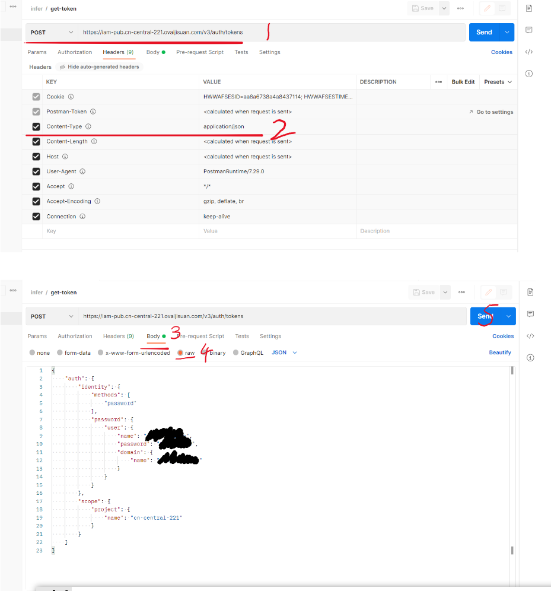
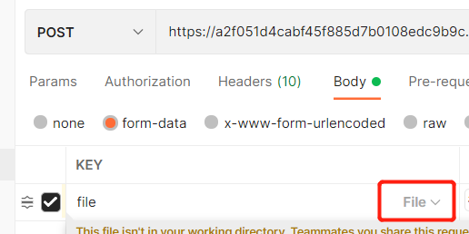

# 模型云端推理服务部署教程

本教程以 **LeNet-Mnist** 和 **紫东.太初文本生成下游任务（Caption）** 为例，分别加载ckpt和mindir两种模式，展示了两种基于自定义镜像的模型在线服务部署全流程方法，
相关环境参考 **用户手册 - 资源准备** 部分。

## 1. LeNet-Mnist 使用微调组件在云端快速发布并部署为在线服务

本案例将以加载ckpt的方式在线部署LeNet模型，具体请参考`model_mnist/README.md`。部署后接口使用请参考第三章`验证接口`。

## 2. Caption 使用微调组件在云端快速发布并部署为在线服务

本案例将以加载mindir的方式在线部署caption模型，具体请参考`model_caption/README.md`。部署后接口使用请参考第三章`验证接口`。 相比加载ckpt的方法，该方法具备 **无需模型结构代码** 、 **加载速度快** 、 **权重文件小** 等优点，适用于参数量比较大的模型。


## 3. 验证接口

所有请求使用Postman进行测试，请安装好对应软件

### 3.1请求Token

1. 修改本地host文件，加入 `**.**.**.** iam-pub.cn-central-221.huaweicloud.com` 避免DNS问题

2.  构造请求
    
    
    +   链接: https://iam-pub.cn-central-221.ovaijisuan.com/v3/auth/tokens
    +   请求body内容:
        ```json
        {
            "auth": {
                "identity": {
                    "methods": [
                        "password"
                    ],
                    "password": {
                        "user": {
                            "name": "【IAM用户名】",
                            "password": "【IAM用户密码】",
                            "domain": {
                                "name": "【帐号名】"
                            }
                        }
                    }
                },
                "scope": {
                    "project": {
                        "name": "cn-central-221"
                    }
                }
            }
        }
        ```
    
3.  拿到Token
    在返回体的Header中，X-Subject-Token字段的值即为Token,一般生效期为24小时，具体请参阅:[ModelArts API](https://docs.ovaijisuan.com/zh-cn/api/modelarts/modelarts_03_0139.html)


### 3.2开始验证(默认请求头请保留)


    1.  `/infer/image` 接口,按要求在Postman中填入如下请求:
        +   请求方式: POST
        +   URL: API接口地址/infer/image
        +   请求头(Header):
            -   X-Auth-Token:"【Token】"
            -   Content-Type: "multipart/form-data"
        +   请求体(body/form-data)
            -   file: 选择文件
        +   注意:file字段需要选择为文件

